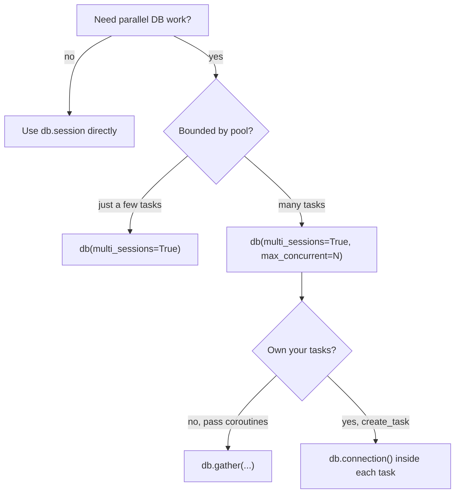

# Concurrent Queries

A single `AsyncSession` cannot run two operations at once — concurrent use
raises SQLAlchemy's `InvalidRequestError: This session is provisioning a new
connection; concurrent operations are not permitted`. To run queries in
**parallel** you need a session **per task**, and you need to keep the number of
simultaneous sessions under your connection-pool limit.

`multi_sessions` mode solves both problems.

## The problem with sharing one session

```python
# ❌ Don't do this — all tasks share the one request session
async def bad():
    await asyncio.gather(
        db.session.execute(text("SELECT 1")),
        db.session.execute(text("SELECT 2")),  # concurrent op on same session
    )
```

## `multi_sessions=True`

Opening `db(multi_sessions=True)` switches `db.session` to give **each task its
own session**, tracked and cleaned up by the middleware:

```python
import asyncio
from sqlalchemy import text

async def run():
    async with db(multi_sessions=True):
        async def worker(n: int):
            # each task gets a distinct session
            return await db.session.execute(text(f"SELECT {n}"))

        await asyncio.gather(*(worker(i) for i in range(5)))
```

Child task sessions are committed/rolled back and closed for you as each task
finishes. All child tasks **must complete before the `async with` block exits**.

## Throttling with `max_concurrent`

Unbounded parallelism will exhaust the pool and raise
`TimeoutError: QueuePool limit ... reached`. Set `max_concurrent` to cap the
number of sessions holding a connection at once. When you do, child tasks must
acquire their session through **`db.connection()`** or **`db.gather()`** so the
middleware owns both the session lifetime and the semaphore slot.

### `db.gather()` — the easy path

A drop-in, pool-aware replacement for `asyncio.gather`. Each coroutine acquires
a slot (and a session) before it runs and releases it afterwards:

```python
async def do_work(n: int) -> int:
    async with db.connection() as session:
        result = await session.execute(text(f"SELECT {n}"))
        return result.scalar_one()


async def run():
    async with db(multi_sessions=True, max_concurrent=10):
        results = await db.gather(*(do_work(i) for i in range(100)))
    # never more than 10 connections in flight
```

!!! warning "Pass coroutines, not Tasks/Futures"
    When `max_concurrent` is set, `db.gather()` accepts **coroutine objects
    only**. A pre-created `Task` or `Future` may already be running outside the
    semaphore, so it is rejected with `TypeError`. Pass `do_work(i)`, not
    `asyncio.create_task(do_work(i))`.

### `db.connection()` — explicit slots

When you create your own tasks, open the session inside each task with
`db.connection()`. It waits for a free slot before creating the session and
releases it when the block exits:

```python
async def run():
    async with db(multi_sessions=True, max_concurrent=10):
        async def execute_query(query: str):
            async with db.connection() as session:
                return await session.execute(text(query))

        tasks = [
            asyncio.create_task(execute_query(f"SELECT {i}"))
            for i in range(50)
        ]
        await asyncio.gather(*tasks)
```

Without `max_concurrent`, `db.connection()` still works — it just creates a
session without throttling and cleans it up on exit.

## Rules to remember

- Child tasks that use the database **must finish before** the owning
  `async with db(multi_sessions=True)` block exits. Tasks still parked on the
  semaphore (or still running) when the block starts closing are cancelled.
- With `max_concurrent` set, **direct `db.session` access from a child task is
  rejected** — it isn't throttled. Use `db.connection()` or `db.gather()`
  instead. (The parent task may still use `db.session` directly.)
- Creating a new `db.connection()` session **after** the context has begun
  closing raises `RuntimeError`.
- `max_concurrent` must be `>= 1`, otherwise `ValueError` is raised.

## Choosing an approach



| Scenario                                   | Use                                            |
| ------------------------------------------ | ---------------------------------------------- |
| A handful of parallel queries              | `db(multi_sessions=True)` + `db.session`       |
| Many queries, cap connections, simplest    | `db(multi_sessions=True, max_concurrent=N)` + `db.gather()` |
| Many queries, you manage the tasks         | `db(multi_sessions=True, max_concurrent=N)` + `db.connection()` |
