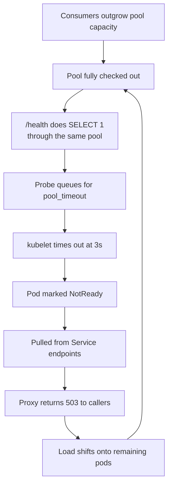

# Health Checks & Pool Saturation

A saturated connection pool does not fail loudly. It queues. Every checkout
waits up to the engine-wide `pool_timeout` — typically 30 seconds, often raised
to 60 in production — and only then raises
`TimeoutError: QueuePool limit of size N overflow M reached`.

That queueing is what turns a local capacity problem into an outage:



The application logs almost nothing while this happens. The probe requests are
cut off client-side, so they never even record a slow response — the pool is
saturated and every dashboard looks fine.

This page covers the three things the library gives you to break that loop.

---

## 1. Give the probe its own engine

The strongest fix: a readiness probe must not compete with business traffic for
connections. [`create_middleware_and_session_proxy()`](multi-database.md) gives
you a second, fully independent proxy — point it at the same database with a
minimal pool of its own.

```python
from fastapi import FastAPI
from sqlalchemy import text

from fastapi_async_sqlalchemy import SQLAlchemyMiddleware, db
from fastapi_async_sqlalchemy import create_middleware_and_session_proxy

ProbeMiddleware, probe_db = create_middleware_and_session_proxy()

app = FastAPI()

# Business traffic — the large pool.
app.add_middleware(
    SQLAlchemyMiddleware,
    db_url=DB_URL,
    engine_args={"pool_size": 20, "max_overflow": 50, "pool_timeout": 60},
)

# Probes — one connection, and never wait for it.
app.add_middleware(
    ProbeMiddleware,
    db_url=DB_URL,
    engine_args={"pool_size": 1, "max_overflow": 0, "pool_timeout": 1},
)


@app.get("/health", include_in_schema=False)
async def health():
    async with probe_db(pool_timeout=1):
        await probe_db.session.execute(text("SELECT 1"))
    return {"status": "ok"}
```

Now the probe answers in milliseconds no matter how saturated the business pool
is, so the pod stays in the load balancer's endpoints and keeps draining its
backlog instead of being evicted mid-incident.

!!! warning "Liveness must not depend on the database"
    Point `livenessProbe` at a path that touches nothing — a plain
    `{"status": "ok"}`. A liveness probe wired to the database restarts healthy
    pods during a database blip, discards their warm pools and in-flight
    requests, and pushes the load onto the pods that are still up.

---

## 2. Fail fast instead of queueing

`pool_timeout` is an engine-wide setting: SQLAlchemy gives you no way to say
"this particular call must not wait." `db(pool_timeout=...)` and
`db.connection(timeout=...)` add that deadline per context.

```python
from fastapi_async_sqlalchemy import PoolTimeoutError

async with db(pool_timeout=1):  # fail after 1s, not after 60
    await db.session.execute(text("SELECT 1"))
```

```python
async with db.connection(timeout=0.5) as session:
    await session.execute(text("SELECT 1"))
```

On expiry you get [`PoolTimeoutError`](../api-reference.md#pooltimeouterror)
instead of parking. Because it subclasses the builtin `TimeoutError`, existing
handlers keep working — but the typed exception is what lets you answer with a
**controlled 503 and a `Retry-After`** rather than an opaque 500:

```python
from fastapi.responses import JSONResponse


@app.exception_handler(PoolTimeoutError)
async def pool_exhausted(request, exc: PoolTimeoutError):
    return JSONResponse(
        {"detail": "database connection pool exhausted"},
        status_code=503,
        headers={"Retry-After": str(exc.retry_after)},
    )
```

A caller that sees `503 + Retry-After` can back off and retry. A caller that
sees a 500 usually fails the whole job.

!!! note "A deadline forces an eager checkout"
    Without `pool_timeout`, a session takes its connection lazily on the first
    query. With one, the connection is checked out when the context is entered,
    so the deadline can be enforced. Keep such blocks short.

Cancelling a checkout mid-flight is safe — the pool slot goes back to the
queue and nothing leaks. This is covered by tests.

---

## 3. See saturation before it becomes a timeout

### `db.pool_status()`

```python
@app.get("/internal/pool", include_in_schema=False)
async def pool():
    return db.pool_status()
```

```json
{
  "pool_class": "AsyncAdaptedQueuePool",
  "size": 20,
  "max_overflow": 50,
  "capacity": 70,
  "checked_in": 3,
  "checked_out": 67,
  "available": 3,
  "saturation": 0.957
}
```

`saturation` is the number to alert on. Pools that don't track connections
(`NullPool`, `StaticPool`) report `None` for every numeric field, so metric
exporters must tolerate `None`.

### `pool_warn_threshold`

Log a throttled warning as soon as the pool crosses a share of its capacity —
long before any request has actually timed out:

```python
app.add_middleware(
    SQLAlchemyMiddleware,
    db_url=DB_URL,
    engine_args={"pool_size": 20, "max_overflow": 50},
    pool_warn_threshold=0.9,  # warn from 90% checked out
    pool_warn_interval=10,  # at most once every 10s
)
```

```
WARNING fastapi_async_sqlalchemy.middleware: Database connection pool is 96%
saturated: 67/70 connections checked out, 3 available (pool_size=20,
max_overflow=50). Requests will start queuing for pool_timeout once it
reaches 100%.
```

---

## 4. Keep sessionless paths sessionless

`exclude_paths` skips the request session entirely for the paths you list
(exact match on the ASGI `scope["path"]`):

```python
app.add_middleware(
    SQLAlchemyMiddleware,
    db_url=DB_URL,
    exclude_paths=["/health", "/metrics"],
)
```

Inside an excluded path `db.session` raises
[`MissingSessionError`](../api-reference.md#missingsessionerror). That is the
point: a probe that quietly reaches for the business pool is exactly the bug
this page is about, and excluding the path turns it into a loud, immediate
error instead of a slow one under load.

---

## Capacity is an invariant, not a setting

None of the above raises your ceiling. If the consumers of an endpoint can
issue more concurrent calls than the service has connections, the pool will
saturate again — raising `max_overflow` only moves the threshold.

Treat this as an invariant and check it whenever either side changes:

```
Σ(consumer replicas × consumer concurrency) ≤ HTTP replicas × (pool_size + max_overflow)
```

When the left-hand side is the one that grew, the fix belongs on the caller:
batch the per-row calls, or bound the fan-out. Inside a single request,
[`max_concurrent`](concurrency.md#throttling-with-max_concurrent) bounds it for
you.
