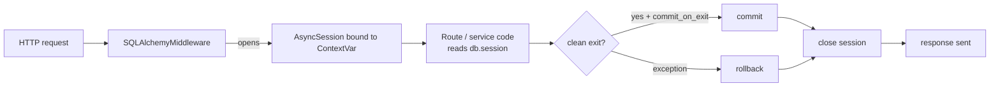

# User Guide

The middleware is small but covers several distinct concerns. Pick the topic you
need — each page is self-contained.

-   :material-database-sync:{ .lg .middle } __Sessions & Contexts__

    ---

    The `db.session` proxy, the `async with db()` context manager,
    `commit_on_exit`, and when each session is created and closed.

    [:octicons-arrow-right-24: Read](sessions.md)

-   :material-engine:{ .lg .middle } __Engine Lifecycle__

    ---

    Who owns the engine (`db_url` vs `custom_engine`), when it is disposed, and
    how to dispose it manually outside an ASGI lifespan.

    [:octicons-arrow-right-24: Read](engine-lifecycle.md)

-   :material-arrow-decision:{ .lg .middle } __Concurrent Queries__

    ---

    `multi_sessions`, `max_concurrent`, `db.gather()` and `db.connection()` —
    parallel work without blowing past the connection pool.

    [:octicons-arrow-right-24: Read](concurrency.md)

-   :material-heart-pulse:{ .lg .middle } __Health Checks & Pool Saturation__

    ---

    Why a saturated pool takes the readiness probe down with it, and the
    fail-fast deadline, pool metrics and excluded paths that stop it.

    [:octicons-arrow-right-24: Read](health-checks.md)

-   :material-download-network:{ .lg .middle } __Streaming Responses__

    ---

    Why streaming bodies need their own session and how to write one safely.

    [:octicons-arrow-right-24: Read](streaming.md)

-   :material-transit-connection-variant:{ .lg .middle } __Multiple Databases__

    ---

    `create_middleware_and_session_proxy()` for independent apps or databases.

    [:octicons-arrow-right-24: Read](multi-database.md)

-   :material-bell-ring:{ .lg .middle } __SQLAlchemy Events__

    ---

    Using `before_insert` / `after_update` and friends with async sessions.

    [:octicons-arrow-right-24: Read](events.md)

-   :material-language-python:{ .lg .middle } __Type Hints__

    ---

    Annotate `db` with `DBSessionMeta` for full mypy / IDE support.

    [:octicons-arrow-right-24: Read](type-hints.md)

## Mental model

The session lives for the duration of the request context. Everything in the
guide is a variation on this: opening extra contexts (`async with db()`),
running many sessions at once (`multi_sessions`), or moving the lifetime into a
streaming body.
